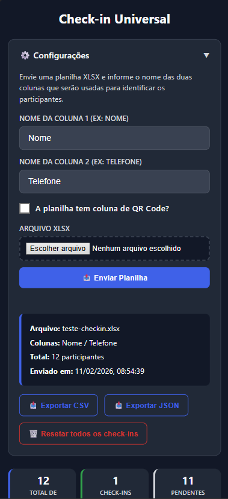
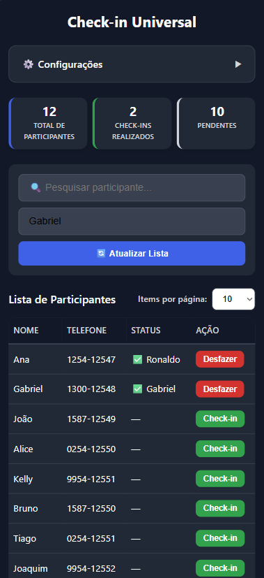

# Check-in Universal

<p align="center">
  <strong>Sistema web de check-in para eventos, conferências e encontros — alimentado por planilha XLSX.</strong>
</p>

<p align="center">
  
  
  
  
</p>

---

## Visão Geral

**Check-in Universal** é uma aplicação web leve e responsiva para controle de presença em eventos. Basta fazer upload de uma planilha XLSX com a lista de participantes e o sistema está pronto para uso — sem integrações externas, sem banco de dados remoto, sem configuração complexa.

### Por que usar?

| Problema | Solução |
|---|---|
| Listas impressas se perdem e são difíceis de consolidar | Interface digital com busca e filtros |
| Múltiplos fiscais sem sincronização | Atualização em **tempo real** via WebSocket |
| Depender de internet estável e APIs externas | Roda **localmente** com dados em arquivo |
| QR Codes precisam de app separado | Scanner de QR **integrado** no navegador |

---

## Funcionalidades

- **Upload de planilha XLSX** — Importa qualquer planilha, basta informar o nome das colunas
- **Busca em tempo real** — Pesquise por qualquer campo (nome, telefone, QR code)
- **Sincronização multi-dispositivo** — Vários fiscais operando simultaneamente via Socket.IO
- **Scanner de QR Code** — Leitura direta pela câmera do celular (opcional, configurável)
- **Exportação CSV/JSON** — Baixe o relatório completo de check-ins a qualquer momento
- **Confirmação visual** — Modal de confirmação antes de cada check-in com dados do participante
- **Dark mode** — Tema escuro automático via `prefers-color-scheme`
- **Responsivo** — Funciona em desktop, tablet e celular
- **Proteção por senha** — Autenticação HTTP Basic opcional
- **Proteção XSS** — Sanitização de dados em todas as renderizações

---

## Screenshots

<p align="center">
  
</p>

<p align="center">
  
</p>

<p align="center">
  
</p>

---

## Arquitetura

```
┌─────────────────────────────────────────────────┐
│                   Navegador                      │
│  ┌───────────┐  ┌──────────┐  ┌──────────────┐  │
│  │ Settings  │  │  Tabela   │  │ QR Scanner   │  │
│  │  Panel    │  │ Paginada  │  │  (jsQR)      │  │
│  └─────┬─────┘  └─────┬────┘  └──────┬───────┘  │
│        │              │               │          │
│        └──────────┬───┘───────────────┘          │
│                   │ fetch + Socket.IO            │
└───────────────────┼──────────────────────────────┘
                    │
┌───────────────────┼──────────────────────────────┐
│            Flask + SocketIO                      │
│  ┌────────────────┼──────────────────────┐       │
│  │  /api/upload   │  /api/participants   │       │
│  │  /api/checkin  │  /api/uncheck        │       │
│  │  /api/export   │  /api/reset          │       │
│  └────────┬───────┴──────────┬───────────┘       │
│           │                  │                   │
│  ┌────────▼──────┐  ┌───────▼────────┐           │
│  │ participants  │  │  checkins.db   │           │
│  │   .json       │  │   (SQLite)     │           │
│  └───────────────┘  └────────────────┘           │
└──────────────────────────────────────────────────┘
```

**Stack técnica:**

| Camada | Tecnologia |
|---|---|
| Backend | Python 3.10+, Flask, Flask-SocketIO, Eventlet |
| Frontend | HTML5, CSS3 (variáveis CSS), JavaScript vanilla |
| Persistência | SQLite (check-ins), JSON (participantes e config) |
| Leitura XLSX | openpyxl |
| QR Scanner | jsQR (client-side, via câmera) |
| Tempo real | Socket.IO (WebSocket com fallback long-polling) |

---

## Quick Start

### 1. Clone o repositório

```bash
git clone https://github.com/gklein7/Checkin-Universal.git
cd Checkin-Universal
```

### 2. Crie o ambiente virtual e instale as dependências

```bash
python -m venv .venv

# Windows
.venv\Scripts\activate

# Linux/macOS
source .venv/bin/activate

pip install -r requirements.txt
```

### 3. Configure as variáveis de ambiente

```bash
cp .env.example .env
```

Edite o `.env` conforme necessário:

```env
ADMIN_PASSWORD=sua-senha-aqui    # deixe vazio para acesso livre
FLASK_SECRET=uma-chave-secreta   # gere com: python -c "import secrets; print(secrets.token_hex(32))"
PORT=5030
FLASK_DEBUG=false
```

### 4. Inicie o servidor

```bash
python app.py
```

Acesse **http://localhost:5030** no navegador.

---

## Como Usar

### Configuração Inicial

1. Abra o painel **⚙️ Configurações** no topo da página
2. Digite o nome da **Coluna 1** (ex: `Nome`) e **Coluna 2** (ex: `Telefone`)
3. Se sua planilha possui QR codes, marque o checkbox e informe o nome da coluna
4. Faça upload do arquivo `.xlsx`

### Operação

1. Informe o **nome do fiscal** no campo dedicado (salvo automaticamente no navegador)
2. Use a **barra de busca** para encontrar participantes
3. Clique em **Check-in**
4. Se QR Code estiver habilitado, aponte a câmera para o código — o check-in é automático

### Exportação

- **CSV** — Planilha com todas as colunas + status de check-in, fiscal e horário
- **JSON** — Dados estruturados para integração com outros sistemas

---

## Estrutura do Projeto

```
Checkin-Universal/
├── app.py                 # Backend Flask (rotas, lógica, Socket.IO)
├── requirements.txt       # Dependências Python com versões fixadas
├── .env.example           # Template de variáveis de ambiente
├── .gitignore             # Arquivos ignorados pelo Git
├── LICENSE                # Licença MIT
├── README.md              # Este arquivo
├── templates/
│   └── index.html         # Template Jinja2 (página única)
├── static/
│   ├── main.js            # Lógica frontend (SPA, scanner, Socket.IO)
│   └── styles.css         # Estilos responsivos com dark mode
└── data/                  # ⚠️ Gerado em runtime, ignorado pelo Git
    ├── participants.json   # Lista de participantes (do XLSX)
    ├── config.json         # Configuração das colunas
    └── checkins.db         # Banco SQLite com estado dos check-ins
```

---

## API Reference

| Método | Rota | Descrição |
|---|---|---|
| `GET` | `/` | Página principal |
| `GET` | `/api/config` | Retorna configuração atual |
| `POST` | `/api/upload` | Upload XLSX + nomes das colunas |
| `GET` | `/api/participants?q=` | Lista participantes (com busca) |
| `POST` | `/api/checkin` | Marca check-in `{ external_id, fiscal }` |
| `POST` | `/api/uncheck` | Desfaz check-in `{ external_id }` |
| `GET` | `/api/checkins/export?format=csv\|json` | Exporta dados |
| `POST` | `/api/reset` | Reseta todos os check-ins |

### WebSocket Events

| Evento | Direção | Payload |
|---|---|---|
| `initial_state` | Server → Client | `{ checkin_state }` |
| `checkin_update` | Server → Client | `{ external_id, checked_in, checked_by, checked_at }` |
| `participants_updated` | Server → Client | `{ total }` ou `{ reset }` |

---

## Segurança

| Medida | Implementação |
|---|---|
| **XSS** | Função `esc()` sanitiza todos os dados renderizados via innerHTML |
| **Autenticação** | HTTP Basic Auth opcional via `ADMIN_PASSWORD` |
| **Debug mode** | Desabilitado por padrão, controlado por variável de ambiente |
| **Upload** | Limite de 16 MB, validação de extensão `.xlsx` |
| **Secrets** | Variáveis sensíveis em `.env`, arquivo ignorado pelo Git |

---

## Roadmap / Contribuições

Ideias para evolução futura:

- [ ] Rate limiting nas rotas de API
- [ ] Testes automatizados (pytest + playwright)
- [ ] Dockerfile para deploy containerizado
- [ ] PWA com service worker para uso offline
- [ ] Múltiplos eventos simultâneos
- [ ] Dashboard com gráficos de check-in por horário

Contribuições são bem-vindas! Abra uma issue ou envie um pull request.

---

## Licença

Distribuído sob a licença MIT. Veja [LICENSE](LICENSE) para mais informações.

---

<p align="center">
  Desenvolvido por <strong>Gabriel Klein</strong>
</p>
